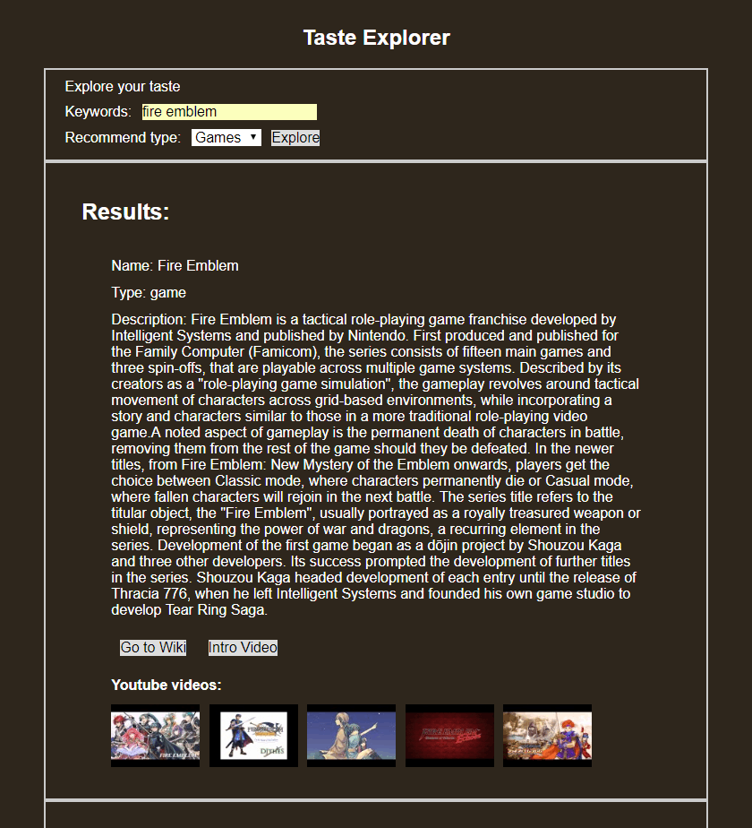

This is a capstone project used to learn about HTML, CSS, Javascript, and implementing several APIs.

Project: Taste Explorer
Live app link: https://azhou125.github.io/Entertain-Checker-and-Recommender/

