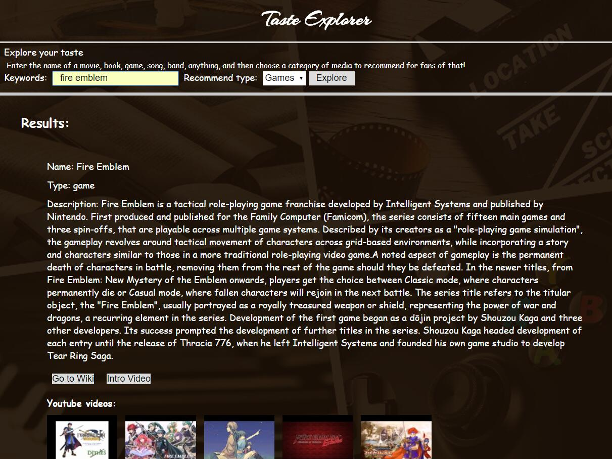
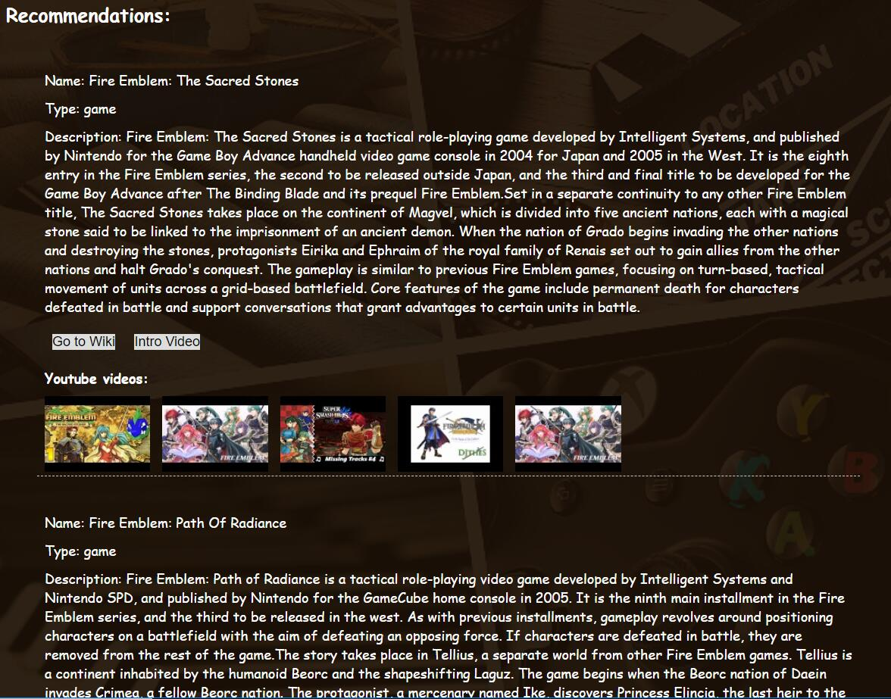

# Description:
This is a capstone project used to learn about HTML, CSS, Javascript, and implementing several APIs.

## Project Demo: Taste Explorer
- [Live Demo](https://azhou125.github.io/Taste-Explorer/)

## Screenshots:

## Summary:
This webpage let users search their interests based on their interets they already have.
At the initial page, user can input the name of their interested workpiece like "Fire Emblem" as game, "Star Wars" as movie.
Then they can also select the recommendation type that they wise to explore.
After they click "Explore". There will be two sections render below: 1) Results section. 2) Recomendations section.

### Results section:
  A brief summary of the interests you put in hte form previously. It contains Name, Type, Description, wiki info, Intro Video, and a list of 5 youtube videos. User can click "Wiki" to open the wiki info about this in a new tab. Clicking on "Intro Video" or those 5 Youtube videos will open a new lightbox for playing the video.

### Recommendations section 
  This section presents at most 5 work pieces recommended to you based on what you put in the form. And each item presents exactly same as the Results section.

## Technology used:(HTML/CSS/JavaScript/jQuery) 
## API used: Tastedive/Youtube ("Promise" is used.)

## Authors
* **Ang Zhou** - ** - Front-End development/testing, styling
